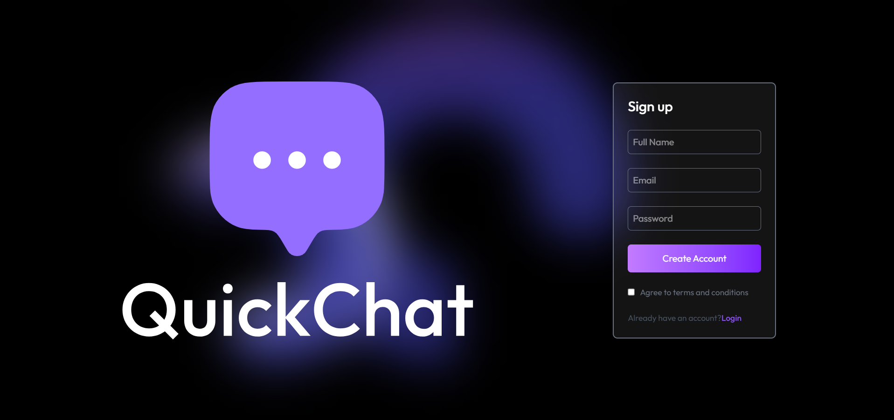

# 💬 QuickChat – Real-Time Chat Application

A full-stack real-time chat application built using the **MERN Stack** with **Socket.IO** for instant messaging.  
Users can chat, send images, see online status, and manage profiles — similar to WhatsApp or Instagram DMs.

---

## 🚀 Live Demo

🔗 Frontend: https://quick-chat-a-real-time-chat-app.vercel.app  
🔗 Backend: (Add your Render backend URL here)

---

## 🛠️ Tech Stack

### Frontend
- React.js (Vite)
- Tailwind CSS
- Axios
- Socket.IO Client
- React Router DOM
- React Hot Toast

### Backend
- Node.js
- Express.js
- MongoDB (Mongoose)
- Socket.IO
- Cloudinary (Image Upload)

---

## ✨ Features

- 🔐 User Authentication (Login / Signup / JWT)
- 💬 Real-time messaging using Socket.IO
- 🟢 Online / Offline user status
- 📷 Send and receive images
- 👀 Seen / Unseen message tracking
- 🔍 Search users
- 🧑 Profile update (name, bio, profile image)
- 🖼️ Media gallery in chat (right sidebar)
- 📱 Responsive UI

---

## 📁 Project Structure
QuickChat/
│
├── client/ # React frontend
│ ├── src/
│ ├── public/
│ └── package.json
│
├── server/ # Node + Express backend
│ ├── controllers/
│ ├── routes/
│ ├── models/
│ ├── lib/
│ └── package.json
│
└── README.md

---

## 🌐 Deployment

### Frontend (Vercel)
- Connected with GitHub
- Auto deploy on every push

### Backend (Render)
- Node.js server deployed
- Environment variables configured
- MongoDB Atlas used for database

---

## 📸 Screenshots

---

## 🧠 Learnings

- Implemented real-time communication using Socket.IO  
- Managed global state with React Context API  
- Handled image uploads using Cloudinary  
- Solved production issues (CORS, Vite asset paths, deployment bugs)  
- Built scalable chat architecture with MongoDB  

---

## 🤝 Contributing

Contributions are welcome!  
Feel free to fork this repo and submit a pull request.

---

## 📄 License

This project is licensed under the MIT License.

---

## 🙋‍♂️ Author

**Shivam Verma**

- GitHub: https://github.com/your-username  
- LinkedIn: (Add your LinkedIn link)

---

⭐ If you like this project, give it a star!